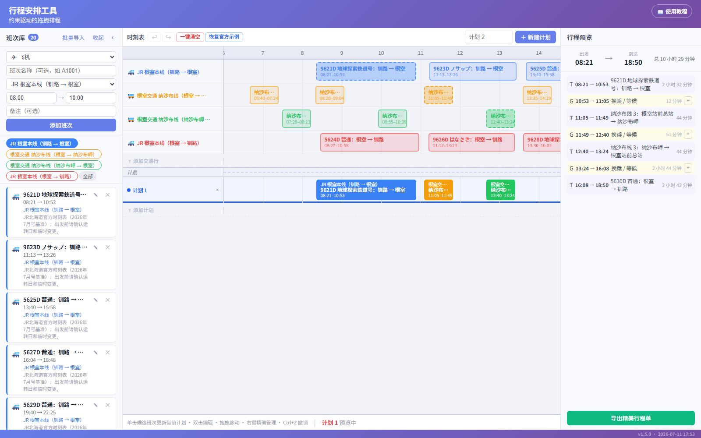
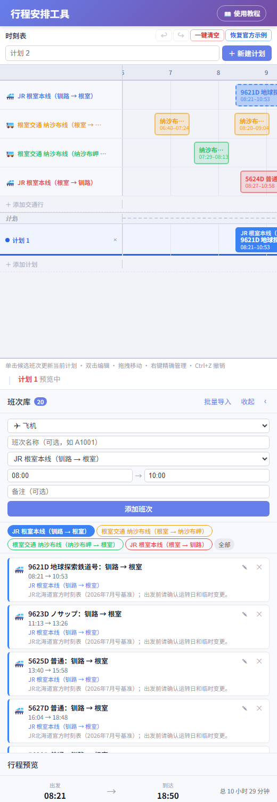
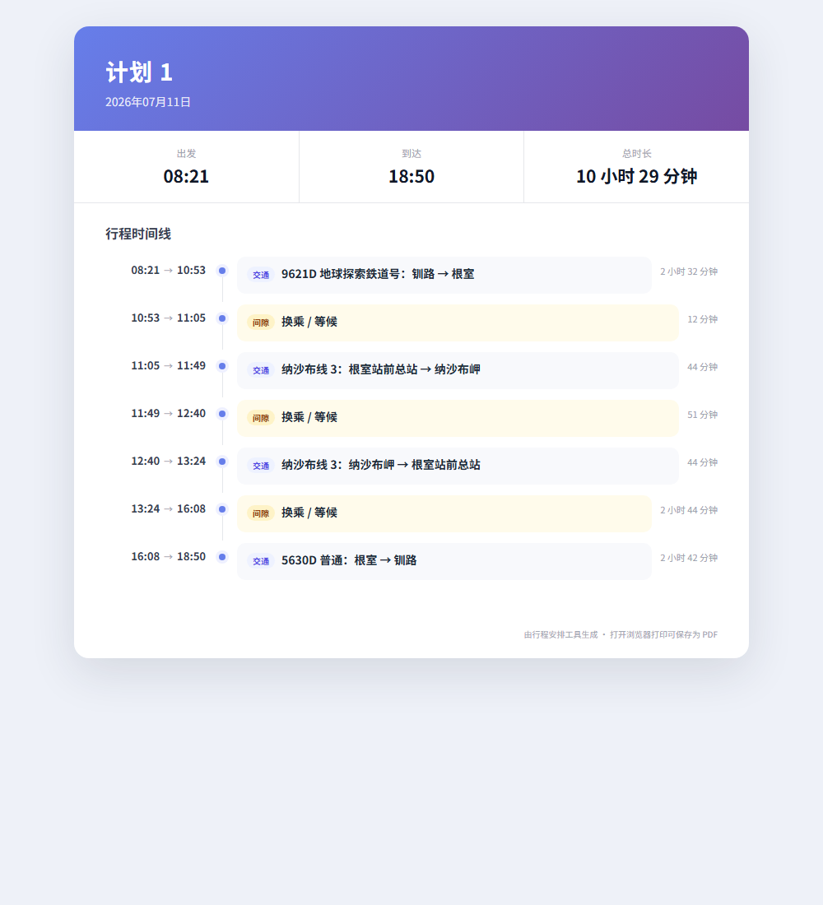

# 📖 行程安排工具：看图就会的超简单教程

> 不怕，点错了就按 `Ctrl + Z`，或点“↩”。大部分操作都可以撤销。

## 第 1 步：打开网页

点这里：[打开行程安排工具](https://xsky123.github.io/itinerary-scheduler/)

第一次打开时，屏幕上已经放好了一张根室官方时刻快照： **4 条去返交通行** + **20 个候选班次** 。“计划 1”默认选择 08:21 从钏路出发、11:05 前往纳沙布岬、12:40 返回根室并在 16:08 回钏路的完整往返。

**注意：** 数据来自 JR 北海道官方 [去程](https://jrhokkaidonorikae.com/vtime/vtime.php?s=2930) / [回程](https://jrhokkaidonorikae.com/vtime/vtime.php?s=2931) 时刻表和 [根室交通官方 PDF](https://www.nemurokotsu.com/manage/wp-content/uploads/2026/03/b89fa631ac14e1911f3a83e1ad37b057.pdf)。出发前仍要确认临时运休、运转日和后续改点。



## 第 2 步：认识三个大盒子

电脑上从左到右看：

1. **左边“班次库”** ：放整张火车、公交或飞机时刻表。
2. **中间“时刻表”** ：看所有候选班次，再更新当前计划。
3. **右边“行程预览”** ：每一段的出发和到达时间放在同一行。

屏幕空间不够时，点“班次库”标题右侧的 `‹` 可以收起整栏；点留下的窄条即可重新展开。时间轴左右滚动时，交通行和计划行的名称会固定在首列。

手机上三个盒子会从上到下排队，往下滑就能看到。



## 第 3 步：一次导入整张时刻表

1. 点左上角的 **“批量导入”** 。
2. 选“火车”或“巴士”，再选要放入的交通行。
3. 每行粘贴一班，写成：

```text
09:00-11:30 JR 花咲线
11:15-13:45 JR 花咲线
13:25-15:55 JR 花咲线
```

4. 点 **“导入整张时刻表”** 。

只想加一班时，点 **“＋ 单班”** 。

## 第 4 步：点一下就更新当前计划

1. 底部有一条高亮的“计划 1”，这就是当前计划。
2. 在候选班次块上 **单击** ，它会立刻进入当前计划。
3. 同一交通行再点另一班时，新班次会自动换掉旧班次。
4. 点“计划 2”的行或其中的块，当前计划就会切换为“计划 2”。

右键菜单仍然保留：可以明确选择“加入计划 2”或“从计划 2移除”。

## 第 5 步：改班次或拖动时间

1. 用鼠标 **双击** 班次块，左边会打开编辑。
2. 抓住块的 **中间** ：整块向左或向右移。
3. 抓住块的 **左边或右边** ：把时间变长或变短。

每次会自动对齐到 5 分钟，不用担心拖歪。

## 第 6 步：加一个“吃饭”或“休息”

1. 找到“计划”里两个班次中间的空白。
2. 在空白处点 **鼠标右键** 。
3. 输入“吃饭”、“买票”或“休息”。

事项不能压住火车或其他事项。拖到边界时，它会自己停下来。

## 第 7 步：遇到重叠怎么办

- **上面的候选班次碰在一起** ：可以，它们会自动上下分开。
- **不同交通行的已选班次重叠** ：会变红，提醒这个接续不可行。
- **事项碰到班次** ：不让它们重叠，会停在空白处。

## 第 8 步：一键清空，以及后悔药

1. 点时刻表上方的红色 **“一键清空”** 。
2. 在弹窗中点“确认清空”。班次、交通行和事项会清空，屏幕上会保留一条空的“计划 1”。
3. 后悔了？立刻点它左边的 **“↩”** ，或按 `Ctrl + Z`。
4. 要重新练习，点 **“恢复官方示例”** ，再在弹窗中点“确认恢复”。这个操作也可以撤销。

## 第 9 步：做成好看的行程单

1. 看右下角。
2. 点绿色的 **“导出精美行程单”** 。
3. 导出文件中，每段交通的起止时间放在同一行。
4. 想要 PDF？打开 HTML 后按 `Ctrl + P`，选“另存为 PDF”。



## 最后只记住三句话

1. **左边导入整张时刻表。**
2. **中间每行 N 选 1。**
3. **点错就按 `Ctrl + Z`。**

发现怪问题时，请在 [GitHub Issues](https://github.com/XSky123/itinerary-scheduler/issues) 告诉我们。
